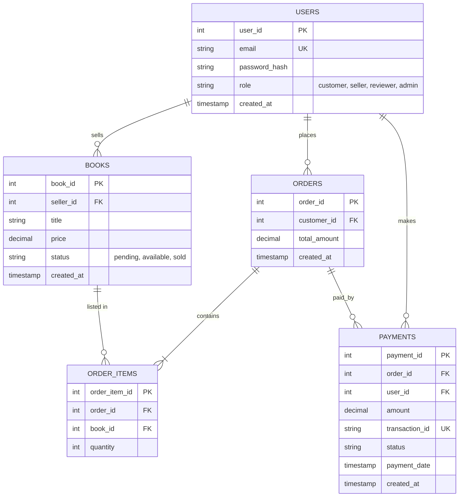

# Bookpass MVP - Database Schema

## Schema Diagram

```mermaid
erDiagram
    USERS ||--o{ BOOKS : sells
    USERS ||--o{ ORDERS : places
    USERS ||--o{ PAYMENTS : makes
    ORDERS ||--|{ ORDER_ITEMS : contains
    BOOKS ||--o{ ORDER_ITEMS : "listed in"
    ORDERS ||--o{ PAYMENTS : paid_by

    USERS {
        int user_id PK
        string email UK
        string password_hash
        string role "customer, seller, reviewer, admin"
        timestamp created_at
    }

    BOOKS {
        int book_id PK
        int seller_id FK
        string title
        decimal price
        string status "pending, available, sold"
        timestamp created_at
    }

    ORDERS {
        int order_id PK
        int customer_id FK
        decimal total_amount
        timestamp created_at
    }

    ORDER_ITEMS {
        int order_item_id PK
        int order_id FK
        int book_id FK
        int quantity
    }

    PAYMENTS {
        int payment_id PK
        int order_id FK
        int user_id FK
        decimal amount
        string transaction_id UK
        string status
        timestamp payment_date
        timestamp created_at
    }
```
